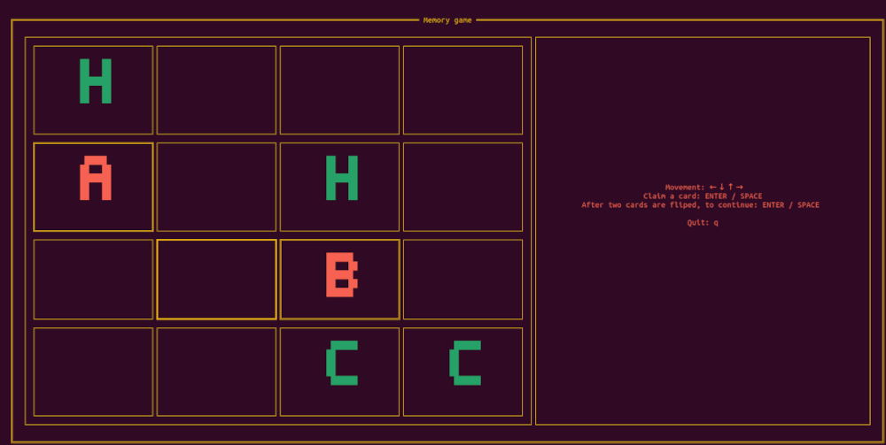

# memory-rs
Memory game. Terminal game in which you should find all pairs.

## Overview
Game is develop in rust programming language using ratatui library. It's a terminal game, in which you should find all pairs.

## Getting started

### Compile and run

 1. For rust and cargo installation, follow instruction from rust official site: **https://www.rust-lang.org/**.
 2. To build app run **cargo build**. Also, you can start build for release with **cargo build -r**
 3. After app is build, run **./target/debug/memory-rs** or if you used **-r** flag **./target/release/memory-rs**

Also, you can skip bullet 2 and 3 and execute **cargo run** to compile and run application in one step.

For more information how to build and run rust project, visit official rust site:  **https://www.rust-lang.org/**.

### How to play
When game is started, game will automaticaly start. Left panel contains board with cards and righ panel contains some information how to play.

## Licence
This project is licensed under the MIT License.